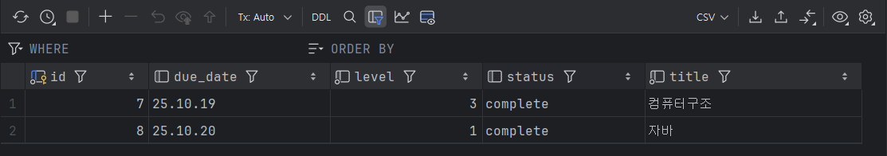

과제 목록 관리 
Spring Boot와 JPA를 사용하여 과제 목록을 관리하는 CRUD API입니다.

프로젝트 개요
   MySQL 데이터베이스에 연결하여 과제(Hw) 데이터를 생성(Create), 조회(Read), 수정(Update), 삭제(Delete)하는 기능을 제공합니다.

엔티티(Entity) 정보
   Hw.java
   과제 정보를 담는 핵심 엔티티 클래스입니다.

    id (Long): 과제 고유 ID. 데이터베이스에서 자동으로 생성됩니다. (PK)
    
    title (String): 과제 이름
    
    status (String): 과제 상태 ("complete" / "incomplete")
    
    level (int): 과제 난이도 (1~5)
    
    dueDate (String): 과제 마감 기한 (예: "25.10.13")

Base URL: http://localhost:8080/hw

1. 과제 저장 (Create)
   새로운 과제를 데이터베이스에 생성합니다.

HTTP Method: POST

URL Endpoint: http://localhost:8080/hw

Request Body:
```json    
{
    "title": "이산수학과제",
    "status": "incomplete",
    "dueDate": "25.10.13",
    "level": 4
}
```
2. 과제 난이도순 조회 (Read)

모든 과제를 난이도(level)가 높은 순서대로 정렬하여 조회합니다. 

title과 level 필드만 가진 DTO를 사용해 응답합니다.

HTTP Method: GET

URL Endpoint: http://localhost:8080/hw/orderByLevel

Response Body:

```json
[
    {
        "title": "이산수학과제",
        "level": 4
    },
    {
        "title": "컴퓨터구조",
        "level": 3
    }
]
```

구현 노트: HwRepo의 findAllByOrderByLevelDesc() 쿼리 메서드를 사용합니다.

3. 과제 상태 확인 (Read)

과제 이름(title)으로 특정 과제를 찾아 상태(status)와 마감 기한(dueDate)을 조회합니다.

HTTP Method: GET

URL Endpoint: http://localhost:8080/hw/{title}/status

예시 URL: http://localhost:8080/hw/컴퓨터구조/status

Response Body:

```json
{
"status": "complete",
"dueDate": "25.10.19"
}
```

구현 노트: HwRepo의 findByTitle(String title) 쿼리 메서드를 사용합니다.

4. 미완료 과제 조회 (Read)

완료되지 않은(incomplete) 모든 과제의 제목을 조회합니다. title 필드만 가진 DTO를 사용해 응답합니다.

HTTP Method: GET

URL Endpoint: http://localhost:8080/hw/incompleteHw

Response Body:

```json
    {
        "title": "이산수학과제"
    }
```

구현 노트: HwRepo의 @Query("SELECT h FROM Hw h WHERE LOWER(h.status) = 'incomplete'") JPQL을 사용합니다.

5. 과제 상태 수정 (Update)

과제 ID로 특정 과제를 찾아 상태(status)를 수정합니다.

HTTP Method: PATCH

URL Endpoint: http://localhost:8080/hw/{id}

예시 URL: http://localhost:8080/hw/5

Request Body: status 필드만 가진 DTO를 사용합니다.

```json
{
    "status": "complete"
}
```

Response Body: "수정 완료" 라는 문자열을 반환합니다.

6. 과제 삭제 (Delete)

과제 ID로 특정 과제를 찾아 데이터베이스에서 삭제합니다.

HTTP Method: DELETE

URL Endpoint: http://localhost:8080/hw/{id}

예시 URL: http://localhost:8080/hw/5

Response Body: "삭제 완료" 라는 문자열을 반환합니다.

7. 모든 과제 조회 (Read)

데이터베이스에 저장된 모든 과제의 전체 정보를 조회합니다.

HTTP Method: GET

URL Endpoint: http://localhost:8080/hw

Response Body: 모든 필드를 포함한 DTO 리스트를 반환합니다.

```json
{
    "id": 7,
    "title": "컴퓨터구조",
    "level": 3,
    "dueDate": "25.10.19",
    "status": "complete"
},
{
    "id": 8,
    "title": "자바",
    "level": 1,
    "dueDate": "25.10.20",
    "status": "complete"
}
```

Framework: Spring Boot

Database: MySQL

Data Access: Spring Data JPA

Query Method: findByTitle(), findAllByOrderByLevelDesc()

JPQL: @Query를 사용하여 미완료 과제 조회 기능 구현

```json
    JPQL: 아직 미완료인 과제들 목록을 리턴합니다.
    @Query("SELECT h FROM Hw h WHERE LOWER(h.status) = 'incomplete'")
    List<Hw> findIncompleteHw();
```

MySQL DB


